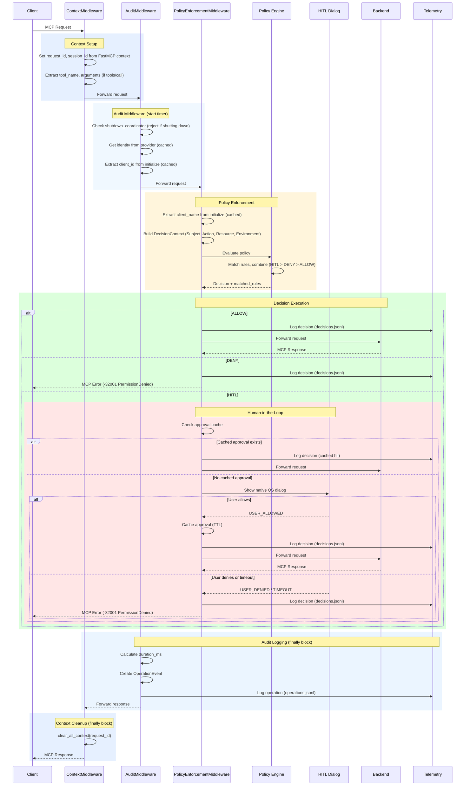

# **MCP ACP Lifecycle**

```mermaid
  sequenceDiagram
      participant Client as Client (Claude Desktop)
      participant Proxy as Proxy
      participant Backend as Backend MCP Server
      participant Logs as Telemetry
      participant Keychain as OS Keychain

      rect rgb(200, 220, 255)
      note over Client,Keychain: Initialization Phase

      Proxy->>Proxy: Load AppConfig & PolicyConfig
      Proxy->>Logs: Validate audit logs writable (fail if not)
      Proxy->>Proxy: Device health check (FileVault, SIP)

      alt Device unhealthy
          Proxy->>Proxy: Show error popup
          Proxy->>Proxy: Raise DeviceHealthError (exit)
      end

      Proxy->>Proxy: Create ShutdownCoordinator (fail-closed)
      Proxy->>Proxy: Create AuditHealthMonitor (30s interval)
      Proxy->>Proxy: Create DeviceHealthMonitor (5min interval)

      rect rgb(220, 235, 255)
      note over Proxy,Keychain: Authentication Setup
      Proxy->>Keychain: Load OIDC token
      Keychain-->>Proxy: JWT (access + refresh token)
      Proxy->>Proxy: Create OIDCIdentityProvider
      alt Auth not configured
          Proxy->>Proxy: Show error popup
          Proxy->>Proxy: Raise AuthenticationError (exit)
      end
      end

      alt transport = None (auto-detect)
          alt Both HTTP and STDIO configured
              Proxy->>Backend: HTTP health check
              alt HTTP reachable
                  Proxy->>Proxy: Select HTTP transport
              else HTTP unreachable
                  Proxy->>Proxy: Fall back to STDIO transport
              end
          else HTTP only configured
              Proxy->>Backend: HTTP health check (must succeed)
              Proxy->>Proxy: Select HTTP transport
          else STDIO only configured
              Proxy->>Proxy: Select STDIO transport
          end
      end

      Proxy->>Proxy: Create SessionManager
      Proxy->>Proxy: Create SessionRateTracker
      Proxy->>Proxy: Register middleware chain
      end

      rect rgb(210, 235, 255)
      note over Client,Logs: Lifespan Start (proxy_lifespan)

      Proxy->>Proxy: Start AuditHealthMonitor
      Proxy->>Proxy: Start DeviceHealthMonitor

      Proxy->>Keychain: Validate identity (get_identity)
      Keychain-->>Proxy: SubjectIdentity
      alt Token expired
          Proxy->>Keychain: Refresh token
          alt Refresh failed
              Proxy->>Logs: Log session_ended (auth_expired)
              Proxy->>Proxy: Show error popup, exit
          end
      end

      Proxy->>Proxy: Create user-bound session (<user_id>:<uuid>)
      Proxy->>Logs: Log session_started (auth.jsonl)
      Proxy->>Proxy: Setup SIGHUP handler (policy hot reload)

      par Background Monitors Running
          Note over Proxy: AuditHealthMonitor checks every 30s
          Note over Proxy: DeviceHealthMonitor checks every 5min
      end
      end

      rect rgb(200, 240, 220)
      note over Client,Logs: MCP Session Handshake

      Client->>Proxy: initialize (stdio)
      Proxy->>Backend: initialize (selected transport)
      Backend-->>Proxy: InitializeResult (serverInfo, capabilities)
      Proxy->>Proxy: Cache client name for session
      Proxy-->>Client: InitializeResult (serverInfo, capabilities)
      Proxy->>Logs: Log initialization metadata

      Client->>Proxy: notifications/initialized
      Proxy->>Backend: notifications/initialized
      end

      rect rgb(200, 255, 220)
      note over Client,Logs: Operation Phase

      Client->>Proxy: MCP Request (stdio)
      Proxy->>Proxy: Policy enforcement & HITL (see Operation Phase diagram)
      Proxy->>Backend: MCP Request (if allowed)
      Backend-->>Proxy: MCP Response
      Proxy->>Logs: Log operation & decision
      Proxy-->>Client: MCP Response (stdio)
      end

      rect rgb(255, 220, 200)
      note over Client,Keychain: Shutdown Phase

      alt Normal Shutdown
          Client->>Proxy: close connection
          Proxy->>Proxy: Remove SIGHUP handler
          Proxy->>Proxy: Stop DeviceHealthMonitor
          Proxy->>Proxy: Stop AuditHealthMonitor
          Proxy->>Logs: Log session_ended (end_reason: normal)
          Proxy->>Proxy: Invalidate bound session
          Proxy->>Proxy: Clear rate tracking data
          Proxy->>Backend: close connection
          Backend-->>Proxy: exit
          Proxy-->>Client: exit
      else Audit Integrity Failure
          Proxy->>Logs: Log critical event (best effort)
          Proxy->>Proxy: Write .last_crash breadcrumb
          Proxy-->>Client: MCP Error
          Proxy->>Proxy: os._exit(10) - fail-closed
      else Device Health Failure
          Proxy->>Logs: Log device_health_failed
          Proxy->>Logs: Log session_ended (device_posture)
          Proxy->>Proxy: Trigger graceful shutdown
      else Auth Token Expired (unrefreshable)
          Proxy->>Logs: Log session_ended (end_reason: auth_expired)
          Proxy-->>Client: MCP Error
      end
      end
```

# **MCP ACP Operation Phase**

```mermaid
 sequenceDiagram
      participant Client as Client
      participant CTX as ContextMiddleware
      participant AUD as AuditMiddleware
      participant PEP as PolicyEnforcementMiddleware

      participant PDP as Policy Engine
      participant HITL as HITL Dialog
      participant Backend as Backend
      participant Logs as Telemetry

      Client->>CTX: MCP Request

      rect rgb(230, 240, 255)
      note over CTX: Context Setup
      CTX->>CTX: Set request_id, session_id from FastMCP context
      CTX->>CTX: Extract tool_name, arguments (if tools/call)
      CTX->>AUD: Forward request
      end

      rect rgb(240, 248, 255)
      note over AUD: Audit Middleware (start timer)
      AUD->>AUD: Check shutdown_coordinator (reject if shutting down)
      AUD->>AUD: Get identity from provider (cached)
      AUD->>AUD: Extract client_id from initialize (cached)
      AUD->>PEP: Forward request
      end

      rect rgb(255, 245, 220)
      note over PEP,PDP: Policy Enforcement

      PEP->>PEP: Extract client_name from initialize (cached)
      PEP->>PEP: Build DecisionContext (Subject, Action, Resource, Environment)
      PEP->>PDP: Evaluate policy
      PDP->>PDP: Match rules, combine (HITL > DENY > ALLOW)
      PDP-->>PEP: Decision + matched_rules
      end

      rect rgb(220, 255, 220)
      note over PEP,Backend: Decision Execution

      alt ALLOW
          PEP->>Logs: Log decision (decisions.jsonl)
          PEP->>Backend: Forward request
          Backend-->>PEP: MCP Response
      else DENY
          PEP->>Logs: Log decision (decisions.jsonl)
          PEP-->>Client: MCP Error (-32001 PermissionDenied)
      else HITL
          rect rgb(255, 230, 230)
          note over PEP,HITL: Human-in-the-Loop
          PEP->>PEP: Check approval cache
          alt Cached approval exists
              PEP->>Logs: Log decision (cached hit)
              PEP->>Backend: Forward request
          else No cached approval
              PEP->>HITL: Show native OS dialog
              alt User allows
                  HITL-->>PEP: USER_ALLOWED
                  PEP->>PEP: Cache approval (TTL)
                  PEP->>Logs: Log decision (decisions.jsonl)
                  PEP->>Backend: Forward request
                  Backend-->>PEP: MCP Response
              else User denies or timeout
                  HITL-->>PEP: USER_DENIED / TIMEOUT
                  PEP->>Logs: Log decision (decisions.jsonl)
                  PEP-->>Client: MCP Error (-32001 PermissionDenied)
              end
          end
          end
      end
      end

      rect rgb(235, 245, 255)
      note over AUD,Logs: Audit Logging (finally block)
      AUD->>AUD: Calculate duration_ms
      AUD->>AUD: Create OperationEvent
      AUD->>Logs: Log operation (operations.jsonl)
      AUD-->>CTX: Forward response
      end

      rect rgb(230, 240, 255)
      note over CTX: Context Cleanup (finally block)
      CTX->>CTX: clear_all_context(request_id)
      CTX-->>Client: MCP Response
      end
```
